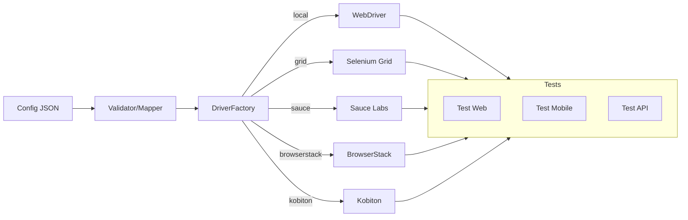

# pureQuantumH8 — Driver Unifié (Portfolio QA)

[](https://github.com/AmiDARK/pureQuantumH8-Officiel/actions/workflows/maven.yml) [](https://creativecommons.org/licenses/by-nc-nd/4.0/)


**Objectif :** démontrer mes compétences d’**Ingénieur Qualification Fonctionnelle** avec **automatisation de tests** (Web/Mobile/Cloud) en Java (Selenium/Appium), CI/CD et bonnes pratiques d’industrialisation.


## 🎥 Démo vidéo — Driver unifié (WebDriver)

[](https://youtu.be/GXgP2HaZ0E8)

> *2019 02 27 pureQuantumH8 - Work In Progress I* — démonstration d’utilisation du driver unifié en mode **WebDriver** (navigateur).

<!-- GIF local optionnel (généré avec scripts/)

-->


## 🚀 Quickstart

```bash
# Cloner et builder
git clone https://github.com/AmiDARK/pureQuantumH8-Officiel.git
cd pureQuantumH8-Officiel
mvn -q -DskipTests package

# Lancer les tests (si présents)
mvn test
```

➡️ Voir **README-QUICKSTART.md** pour plus de détails (exemple minimal, mapping JSON → capabilities).


## 🧩 Portfolio — Compétences illustrées
- Java / Maven • Selenium • Appium • CI GitHub Actions
- Design d’abstractions (Factory/Strategy), séparation **config ↔ code**
- Gestion des secrets, docs onboarding, templates issues/PR
- Démos : Web local, Mobile cloud (Sauce/BrowserStack/Kobiton), API (optionnelle)

➡️ **Matrice :** `docs/portfolio/SKILLS_MATRIX.md`  
➡️ **Use cases :** `docs/portfolio/USE_CASES.md`


## 🏗️ Architecture (vue pédagogique)



➡️ Détails : `docs/portfolio/ARCHITECTURE.md`


## 📈 CI/CD & Reporting
- **GitHub Actions** : build + tests Maven (`.github/workflows/maven.yml`).
- Artefacts tests (Surefire) disponibles dans l’onglet **Actions** (si des tests sont présents).
- (Option) Ajout d’un rapport Allure/HTML si le projet l’intègre ultérieurement.


## 🛡️ Sécurité & Contributions
- **Licence :** CC BY-NC-ND 4.0 (non commercial, pas de dérivés).
- **Contribuer :** voir `CONTRIBUTING.md` (PR docs/CI/outillage bienvenues).
- **Secrets :** voir `docs/SECURITY.md` (variables d’environnement / GitHub Secrets).


## 📌 À propos
Ce dépôt est un **exemple professionnalisant** servant de **portfolio** : il illustre ma façon de concevoir un outillage d’automatisation **lisible**, **maintenable** et **industrializable**, sans prétendre être un produit fini.
