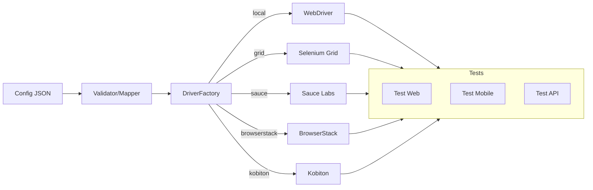

# Architecture — Vue pédagogique

- **Config JSON** : source de vérité (environnements, capabilities).  
- **Validator/Mapper** : détecte les erreurs tôt, normalise les clés.  
- **DriverFactory** : instancie le bon provider en masquant la complexité.  
- **Tests** : consomment une interface simple et réutilisable.
